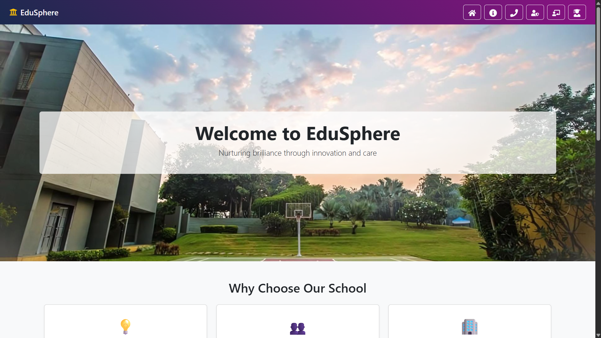
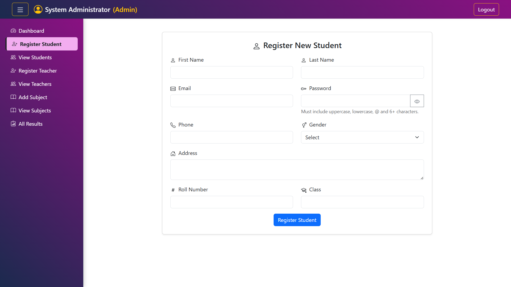
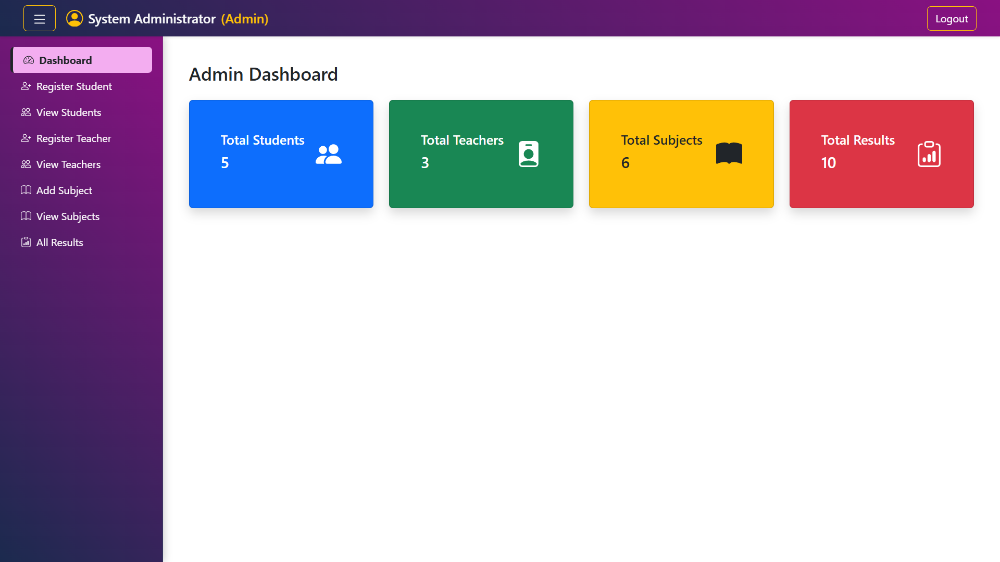
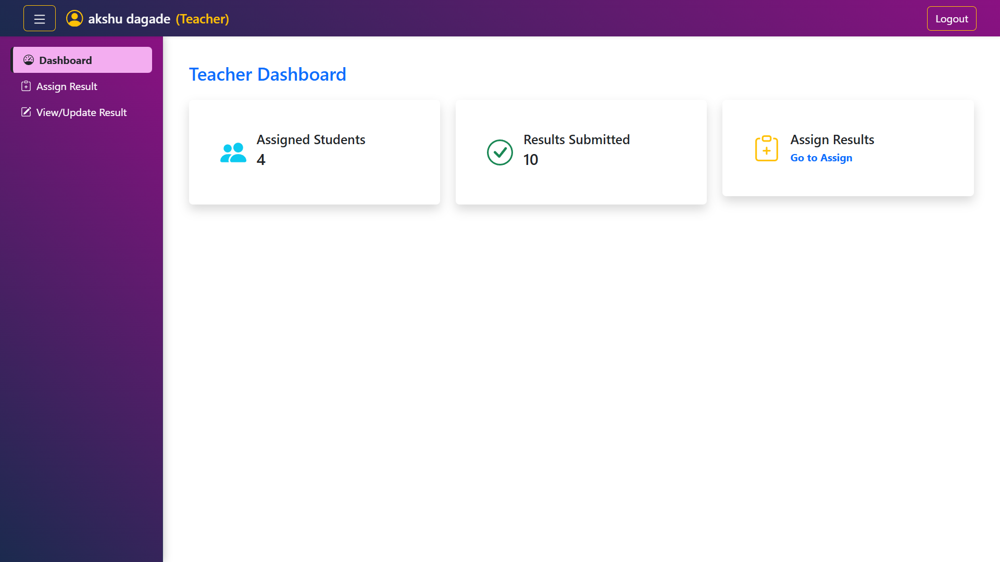
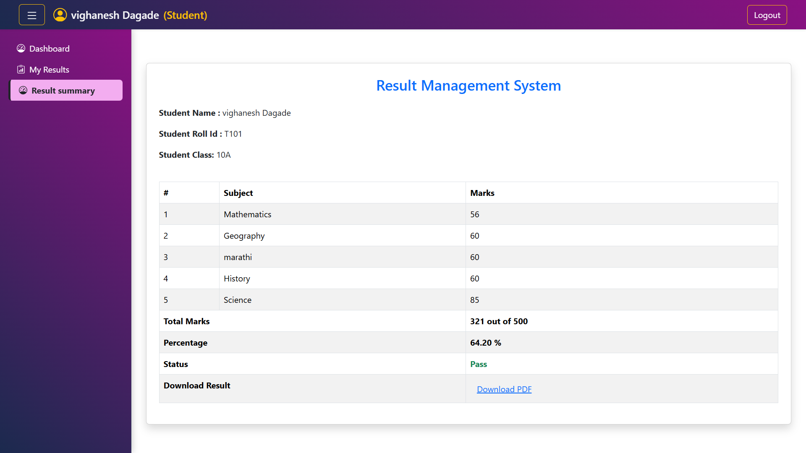

# 🎓 Student Result Management System

A full-stack role-based web application developed using **ASP.NET Core Web API**, **React (Vite)**, and **Entity Framework Core**. This system manages student results and supports three user roles — **Admin**, **Teacher**, and **Student** — each with their own secure dashboard and dedicated features.

---

## 🚀 Tech Stack

| Layer      | Technology Used                                |
|------------|-------------------------------------------------|
| Frontend   | React.js (Vite), React Bootstrap                |
| Backend    | ASP.NET Core Web API (C#)                       |
| Database   | SQL Server / Entity Framework Core             |
| Auth       | JWT Authentication + ASP.NET Identity           |
| Testing    | Postman (for API testing)                       |

---

## 🎯 Roles & Functionalities

### 🔐 Public User
- 🔸 **Admin Login** → `POST /api/auth/login`
- 🔸 **Teacher/Student Login** → `POST /api/auth/login`
> Upon login, a secure **JWT Token** is issued to access role-protected APIs.

---

### 👨‍🏫 Admin Dashboard
- 🔹 Register/View/Update/Delete Students  
  - `POST /api/auth/register-student`  
  - `GET /api/student`, `PUT/DELETE /api/student/{id}`
- 🔹 Register/View/Update/Delete Teachers  
  - `POST /api/auth/register-teacher`  
  - `GET /api/teacher`, `PUT/DELETE /api/teacher/{id}`
- 🔹 Create/View/Update/Delete Subjects  
  - `POST /api/subject`, `GET /api/subject`, `PUT/DELETE /api/subject/{id}`
- 🔹 View All Results  
  - `GET /api/result`  
  - Includes percentage calculation and Pass/Fail status

---

### 👨‍🏫 Teacher Dashboard
- 🔹 View Assigned Students/Subjects  
  - `GET /api/teacher/assigned`
- 🔹 Assign or Update Marks for Students  
  - `POST /api/result`, `PUT /api/result/{id}`

---

### 👨‍🎓 Student Dashboard
- 🔹 View Own Profile → `GET /api/studentviewresult/profile`
- 🔹 View Own Results → `GET /api/studentviewresult/my-results`
  - Shows subject-wise marks, total, percentage, and **Pass/Fail** status
- 🔹 Download PDF Report Card

---

## 📸 Screenshots


| Home | Login | Register | 
|-------|------------------|-----------------|
|  |  | 

| Admin Dashboard | TeacherDashboard | Student Dashboard | Student Result |
|-------|------------------|-----------------|
|  |  |  |

---

## 🗂️ Project Structure

```bash
StudentResultManagement/
├── backend/                 # ASP.NET Core Web API
│   ├── Controllers/
│   ├── Models/
│   ├── DTOs/
│   ├── Data/
│   └── Program.cs
│
├── frontend/                # React + Vite + Bootstrap
│   ├── components/
│   ├── pages/
│   ├── layouts/
│   └── main.jsx
│
├── assets/                  # Screenshots and demo
└── README.md
